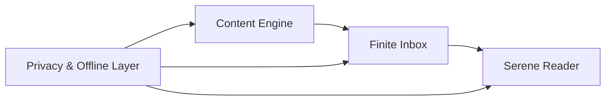
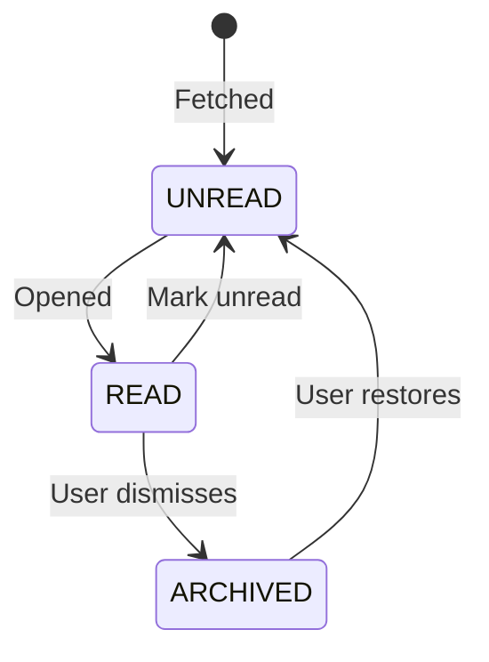

# SERENESEC (OSR-01)
## Distraction-Free Cybersecurity Reading Platform
### Product & Technical Specification – v1.1

---

## 1. Project Overview

| Field | Value |
|-------|-------|
| **Project Name** | SereneSec |
| **Internal Code** | OSR-01 |
| **Platform** | Android (Native, Kotlin) |
| **License** | AGPL v3 (Open Source) |
| **Distribution** | GitHub Releases, F-Droid (future) |
| **Target Audience** | Cybersecurity students, researchers, practitioners |

---

## 2. Vision & Core Philosophy

SereneSec is a **local-first, privacy-preserving, distraction-free** cybersecurity reading environment designed to counter infinite scrolling, attention hijacking, and platform dependency.

> [!IMPORTANT]
> This is NOT a news app, social feed, or engagement-optimized aggregator. It's a **finite reading inbox** that users can meaningfully complete.

### Non-Negotiable Principles

| Principle | Implementation |
|-----------|----------------|
| **Zero-Server Architecture** | All logic, storage, parsing on-device. No backend, no telemetry. |
| **Finite Consumption Model** | Static feeds, manual refresh only. No infinite scroll. |
| **Intentional Friction** | Actively resists context switching and dopamine loops. |
| **Creator Respect** | Default mode loads full webpage (ads/analytics intact). |
| **Privacy First** | No analytics SDKs, no tracking, no cloud sync. |

---

## 3. Functional Modules



---

## 4. Module A – Content Engine (Input)

### 4.1 Zero-Config Onboarding
- Bundled `sources_default.json` with curated cybersec sources
- User sees content immediately on first launch
- File is static, versioned, and auditable

### 4.2 Supported Source Types

| Type | Input Format | Internal Handling |
|------|--------------|-------------------|
| RSS/Atom Feeds | Standard URLs | XmlPullParser streaming |
| GitHub Releases | `github.com/user/repo` | Auto-convert to `/releases.atom` |
| CVE Feeds (Phase 2) | JSON APIs | Dedicated adapters |

> [!NOTE]
> GitHub Atom feeds have **no rate limiting** unlike the REST API. Safe for unauthenticated use.

### 4.3 Source Management
- Toggle individual sources on/off
- Soft-disable (never auto-delete)
- Sources persist even if temporarily unreachable

### 4.4 Share Intent Handler *(NEW in v1.1)*
- Accept URLs shared from Chrome/Firefox/other apps
- Auto-detect if URL is RSS feed or article
- Quick-add to reading queue

---

## 5. Module B – Finite Inbox (Organization)

### 5.1 Session-Based Feed
- Feed is **static per fetch cycle**
- New items appear only on:
  - Manual pull-to-refresh
  - Background WorkManager sync (configurable)
- **No live updates, no auto-insertion**

### 5.2 Article Lifecycle



### 5.3 Completion Feedback
- Empty inbox shows calm "All Caught Up" screen
- No prompts, no gamification, no streaks
- **Reinforces closure, not urgency**

### 5.4 Local Filtering
Non-algorithmic category filters:
- 📰 News
- 🔧 Tool Updates  
- 🔒 CVEs
- 📚 Research

### 5.5 Background Sync Settings *(NEW in v1.1)*

| Option | Interval |
|--------|----------|
| Frequent | Every 2 hours |
| Normal (default) | Every 6 hours |
| Battery Saver | Every 12 hours |
| Manual Only | Never auto-sync |

---

## 6. Module C – Serene Reader (Consumption)

### 6.1 Internal Browser (WebView)
- All links open inside embedded WebView
- External browser intents blocked by default
- **No tabs, no downloads, no redirects without confirmation**

### 6.2 Dual Reading Modes

| Mode | Behavior | When Active |
|------|----------|-------------|
| **Respectful Mode** (default) | Full webpage with ads/analytics intact | On article open |
| **Focus Mode** | Clean reading layout via Readability.js | User activates via FAB |

### 6.3 Focus Mode Guarantees
- ✅ No sidebars, popups, comments
- ✅ No related-article rabbit holes
- ✅ Single font family (system or custom)
- ✅ Forced dark mode option
- ✅ Line length normalization
- ✅ Original URL always visible

### 6.4 Code Block Protection
- `<pre>` and `<code>` blocks preserved
- No reflow, truncation, or font corruption
- Horizontal scrolling maintained

### 6.5 External Link Escape
Bottom sheet confirmation:
> "This link requires an external browser. Open in Chrome?"
> 
> [Cancel] [Open]

---

## 7. Module D – Privacy & Offline

### 7.1 Offline-First Behavior
- Article metadata always stored locally (Room)
- Full HTML cached on-demand
- Images cached via Coil (configurable TTL)

### 7.2 Data Isolation

> [!CAUTION]
> **Strictly Prohibited:**
> - Firebase (any service)
> - Crashlytics
> - Any analytics SDK
> - Remote config
> - Cloud sync

All logs remain local and user-accessible.

---

## 8. Technical Architecture

### 8.1 Pattern
**Clean Architecture + MVVM** with Unidirectional Data Flow

### 8.2 Layer Responsibilities

```
┌─────────────────────────────────────────┐
│              UI Layer                    │
│  Jetpack Compose • StateFlow • WebView  │
├─────────────────────────────────────────┤
│           Domain Layer                   │
│  UseCases • Repository Interfaces       │
├─────────────────────────────────────────┤
│            Data Layer                    │
│  Room DAOs • Retrofit • Feed Parsers    │
└─────────────────────────────────────────┘
```

### 8.3 Key Use Cases
- `FetchFeedsUseCase`
- `ParseFeedUseCase`
- `CacheArticleUseCase`
- `SanitizeHtmlUseCase`
- `ToggleSourceUseCase`

---

## 9. Technology Stack

| Component | Technology | Rationale |
|-----------|------------|-----------|
| Language | Kotlin | Coroutines, null safety |
| UI | Jetpack Compose | Modern, declarative |
| Database | Room (SQLite) | Type-safe persistence |
| Networking | Retrofit + OkHttp | Stable, interceptable |
| XML Parsing | XmlPullParser | Low memory footprint |
| Background | WorkManager | Battery-aware scheduling |
| Reader Engine | Android WebView | JS injection support |
| Reader Logic | Mozilla Readability.js | Industry-proven |
| Image Loading | Coil | Kotlin-first, efficient |
| DI | Hilt | Standard Android DI |

---

## 10. Database Schema (Room)

### Sources Table
```kotlin
@Entity
data class Source(
    @PrimaryKey val id: String,
    val name: String,
    val url: String,
    val type: SourceType, // RSS, GITHUB, API
    val category: Category,
    val isEnabled: Boolean = true,
    val isBuiltIn: Boolean = false,
    val lastFetchTime: Long? = null,
    val errorCount: Int = 0
)
```

### Articles Table
```kotlin
@Entity
data class Article(
    @PrimaryKey val id: String,
    val sourceId: String,
    val title: String,
    val summary: String?,
    val contentUrl: String,
    val publishedDate: Long,
    val state: ArticleState, // UNREAD, READ, ARCHIVED
    val category: Category,
    val contentHtml: String? = null, // Cached on-demand
    val createdAt: Long
)
```

---

## 11. Security Considerations

| Area | Implementation |
|------|----------------|
| WebView | Sandboxed, JavaScript disabled by default (enabled only for Focus Mode) |
| Network | HTTPS enforced, explicit opt-in for HTTP |
| RSS Parsing | Input sanitization, script stripping |
| HTML Cache | Defensive parsing, stored XSS prevention |

---

## 12. Explicit Non-Goals

SereneSec will **NOT**:
- ❌ Provide recommendations
- ❌ Track user behavior
- ❌ Sync across devices
- ❌ Monetize content
- ❌ Host or redistribute articles
- ❌ Compete with news platforms
- ❌ Have social features

---

## 13. Success Criteria (v1)

- [ ] Users complete reading sessions without distraction
- [ ] No app swapping during reading by default
- [ ] Content creators' pages are respected
- [ ] Battery and data usage remain minimal
- [ ] Codebase is auditable and contributor-friendly

---

## 14. Legal Disclaimer *(NEW in v1.1)*

> [!NOTE]
> SereneSec displays content from third-party sources. All content remains property of original creators. This application does not host, redistribute, or modify content for distribution. Reader transformations occur locally on the user's device for personal use only.

---

## Design Philosophy

> *This project optimizes for **calm, trust, and longevity**, not growth metrics.*
> 
> *Any feature that increases engagement at the cost of focus is a regression.*

**When in doubt, default to:**
- Less automation
- More user control
- Fewer background actions
- Stronger friction
